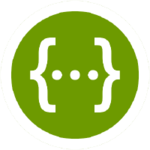

##  :exclamation: 프로젝트 소개

<div align="center">

</div>

- ##### 프로젝트명 : 써닌(SUN-IN)


- ##### 노션 : https://tinted-bird-b78.notion.site/SUN-IN-PROJECT-d48e838e9740415ab87f2cb9c3f5985b

- ##### 서비스 특징

  - ##### 선한 영향력 프로젝트 썬인🌏☀입니다. 
  - ##### 환경 보호, 기부 ,봉사 활동 등 일상생활 속 선한 영향력을 함께 실천하고 서로 공유할 수 있는 공간으로 여러분을 초대합니다.

- ##### 기간 : 2022.01.04 ~ 2022.02.18

- ##### 주요 기능

  | 기능         | 내용                                     |
  | ---------- | -------------------------------------- |
  | SNS 기능     | 개인과 기업들의 활동이 담긴 게시물 공유                 |
  | 써닌(SUN-IN) | 사회 공헌 활동 참여일수에 따라 자신이 노력한 결과를 시각화하여 제공 |

  - ##### 상세기능
    
    - ##### 소셜 로그인
    - ##### 회원 관리
    - ##### 검색기능
      
      - ##### 내용 해시태그 검색
    - ##### 피드 기능
      
      - ##### 유저들이 활동이 담긴 게시물 공유
      - ##### 게시글, 댓글 CRUD(Create, Read, Update, Delete)
    - ##### 좋아요, 팔로우 기능
    - ##### 알림 기능
    - ##### 실시간 채팅 기능
    - ##### 프로필 옆 상단에 써닌(SUN-IN) 표시로 참여일수 시각화

- ##### 주요 기술

  - ##### Single Page Application

  - ##### CSS

  - ##### REST API

  

## :date: 프로젝트 진행

### sub PJT Ⅰ

- ##### 기간 : 2022.01.10 ~ 2022.01.14 (1주)

- ##### 목표 : 모바일 웹 디자인 및 기본 구성

- ##### 진행상황

  - ##### 1/10

    - ##### [서비스를 개발하기 전 기획 고민](/문서/와이어프레임/README.md)

    - ##### [와이어프레임 작성](/문서/와이어프레임/README.md)

  - ##### 1/11

    - ##### [유스케이스](/문서/유스케이스/README.md)

    - ##### [IA](/문서/IA/README.md)

  - ##### 1/12

    - ##### [MVP](/문서/IA/README.md)

    - ##### [아키텍처(Architecture)](/문서/아키텍처/readme.md)

  - ##### 1/13

    - ##### [화면설계](/문서/화면설계/readme.md)

    - ##### [DB 결정](/문서/화면설계/readme.md)

    - ##### [ERD](/문서/ERD 설계/readme.md)

### sub PJT Ⅱ

- ##### 기간 : 2022.01.17 ~ 2022.01.28 (2주)

- ##### 목표 : SNS 기본 기능 개발

- ##### 진행상황

  - ##### 1/17

    - ##### [규칙 설정](/문서/Rule.md)

    - ##### 2주차 개발 계획 수립

### sub PJT Ⅲ

- ##### 기간 : 2022.01.29 ~ 2022.02.18 (총3주)

- ##### 목표 : 웹 큐레이션 SNS 완성

  

## :raising_hand:팀 소개

- ##### 하지애 : `팀장`, 프론트엔드 개발
- ##### 손민기 : 프론트엔드 개발
- ##### 오윤진 : 백엔드 개발
- ##### 최다운 : 백엔드 개발
- ##### 김희섭 : 백엔드 개발
- ##### 김경민 : 백엔드 개발


## :hammer:기술 스택

### **Front-end**

|  |  |  |  |  |  |  |
| :----------------------------------------------------------: | :----------------------------------------------------------: | :----------------------------------------------------------: | :----------------------------------------------------------: | :----------------------------------------------------------: | :----------------------------------------------------------: | :----------------------------------------------------------: |
|                            HTML5                             |                             CSS3                             |                       JavaScript(ES6)                        |                           React.js                           |                           NEXT.js                            |                          TypeScript                          |                      Semantic UI React                       |

### **Back-end**

|  |  |  |  |  |
| :-----------------------------------------------: | :----------------------------------------------------------: | :----------------------------------------------------------: | :---------------------------------------------: | :----------------------------------------------: |
|                    Springboot                     |                             JPA                              |                            Gradle                            |                     Swagger                     |                     QueryDSL                     |

### **Server**

|  |  |  |
| :-------------------------------------------: | :----------------------------------------: | :-----------------------------------------------------: |
|                    Docker                     |                    aws                     |                         aws s3                          |

### **DB**

|  |  |
| :------------------------------------------: | :----------------------------------------------------------: |
|                    MySQL                     |                           mongoDB                            |

### **Version Control**

|  |  |
|:-----------------------------------------------------------------------------------------------------------------:|:--------------------------------------------------------------------------------------------------------------:|
| Git                                                                                                               | GitLab                                                                                                         |

### **Issue Tracking System**

|  |
| :----------------------------------------------------------: |
|                             Jira                             |


##  :bookmark_tabs: 페이지소개

### 메인 페이지


### 피드 작성페이지


### 피드 페이지


### 피드 상세페이지


### 프로필 페이지


### 프로필 수정페이지


### 다른 유저 프로필 페이지


### 랭킹


### 채팅


### Frontend

```
패키지 설치
$ npm install
```

```
프로젝트 실행
$ npm run dev
```


### Backend

```
$ java jar jar파일명
```
