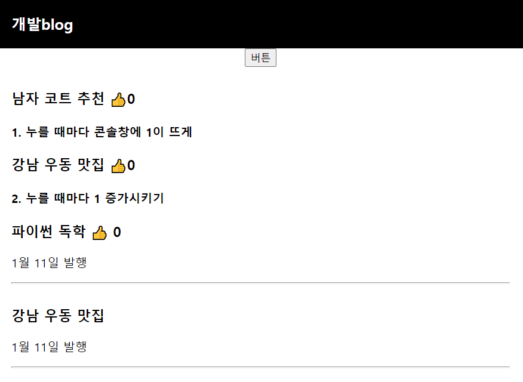
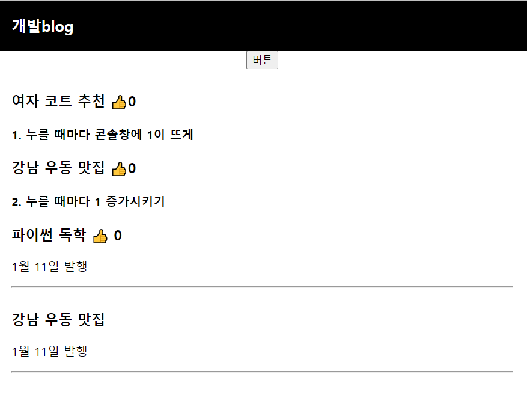
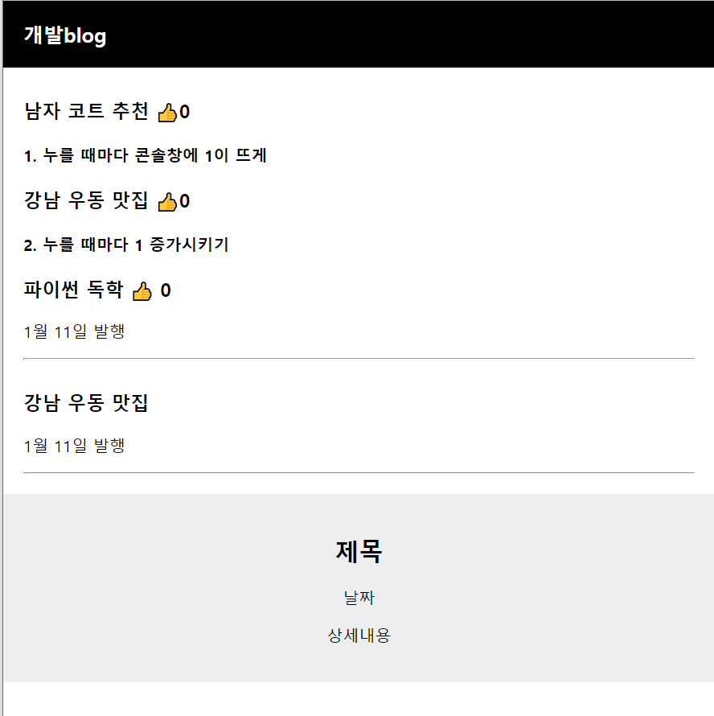
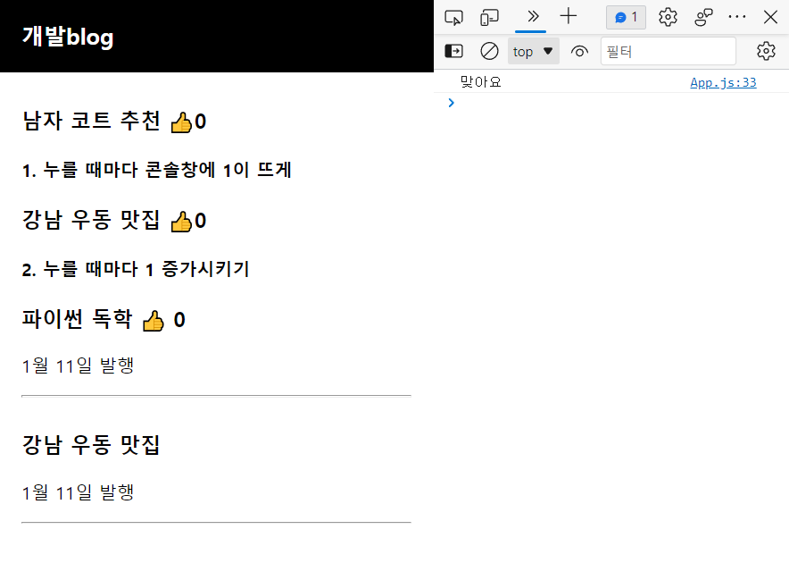
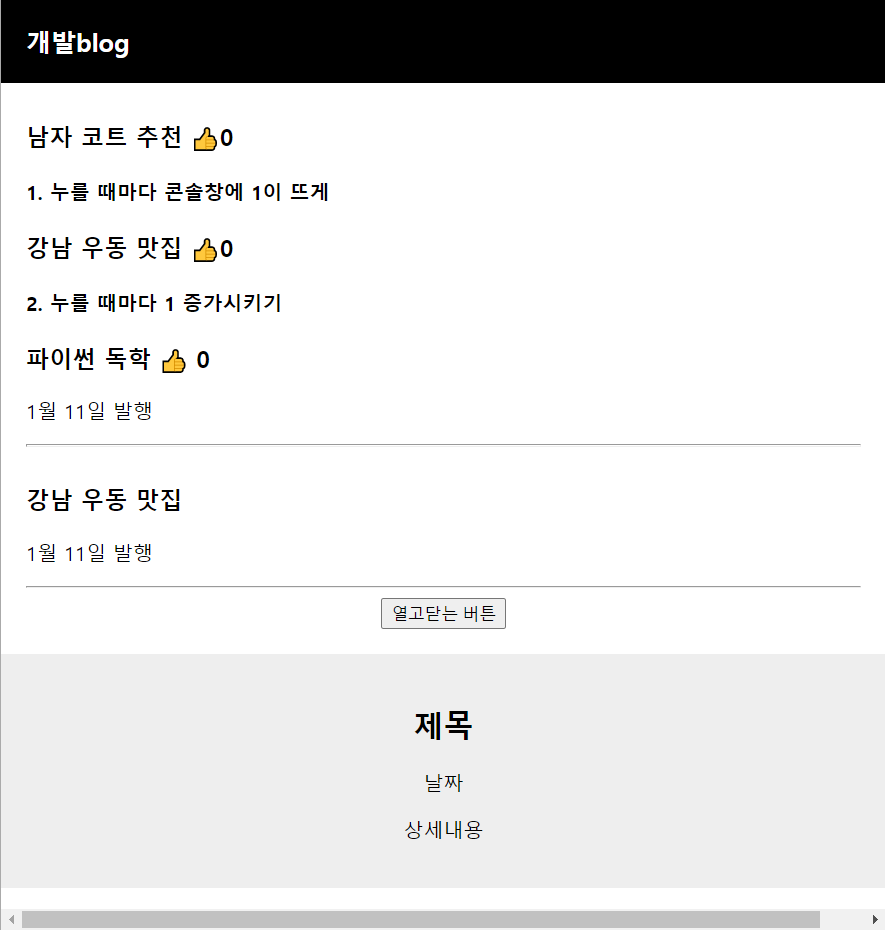
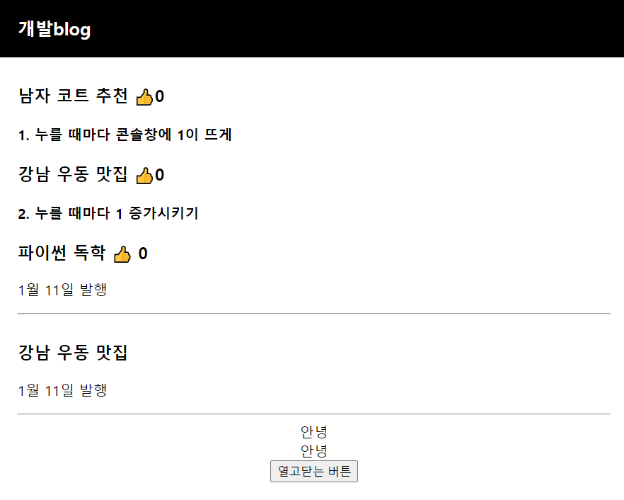
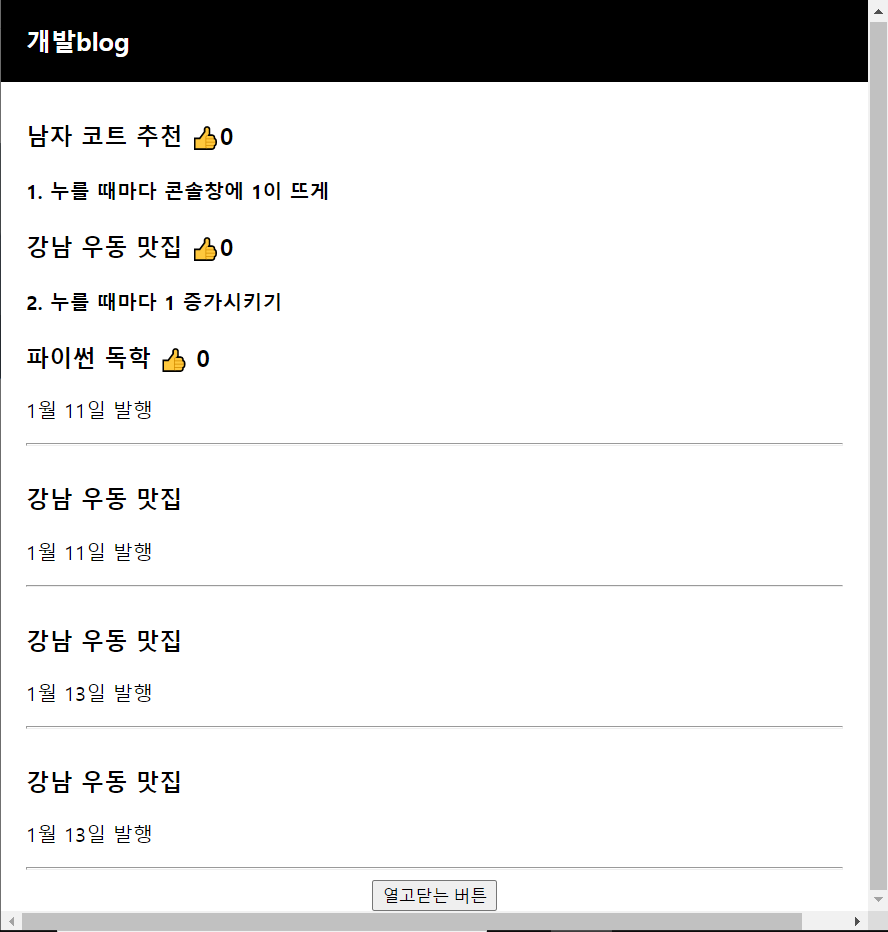
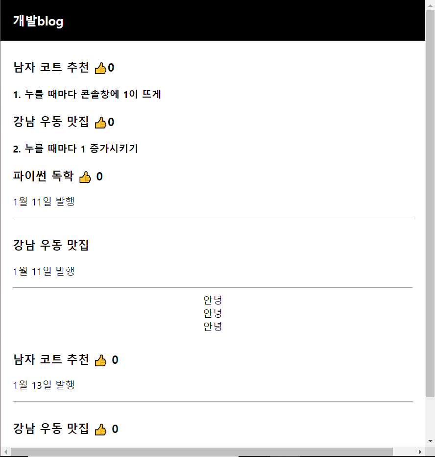

# 프론트엔드 학습내용

<!-- 필수 항목 -->

## 목차

1. 손민기

2. 하지애

- React 학습 Part 1
  1. [React 강의 OT : 왜 리액트가 필요한가](#1-react-강의-ot--왜-리액트가-필요한가)
  2. [리액트 React 설치와 개발환경 셋팅(2021 ver)](#2-리액트-react-설치와-개발환경-셋팅2021-ver)
  3. [JSX를 이용해 HTML 페이지 제작해보는 건 처음이겠죠](#3-jsx를-이용해-html-페이지-제작해보는-건-처음이겠죠)
  4. [중요한 데이터는 변수말고 리액트 state로 만들랬죠](#4-중요한-데이터는-변수말고-리액트-state로-만들랬죠)
  5. [버튼에 기능개발을 해보자 & 리액트 state 변경하는 법](#5-버튼에-기능개발을-해보자--리액트-state-변경하는-법)
  6. [숙제 해설 : 블로그 수정버튼 만들기](#6-숙제-해설--블로그-수정버튼-만들기)
  7. [React Component : 많은 div들을 한 단어로 줄이고 싶은 충동이 들 때](#7-react-component--많은-div들을-한-단어로-줄이고-싶은-충동이-들-때)
  8. [클릭하면 동작하는 UI(모달창) 만드는 법](#8-클릭하면-동작하는-ui모달창-만드는-법)
  9. [map : 많은 div들을 반복문으로 줄이고 싶은 충동이 들 때](#9-map--많은-div들을-반복문으로-줄이고-싶은-충동이-들-때)
  10. [props : 자식이 부모의 state를 가져다쓰고 싶을 땐 말하고 쓰셔야 합니다](#10-props--자식이-부모의-state를-가져다쓰고-싶을-땐-말하고-쓰셔야-합니다)


## 손민기

## Next.js

```
프로젝트 생성
npx create-next-app@latest --ts
or
yarn create next-app --typescript

프로젝트 실행
npm run dev
```


## React

```
프로젝트 생성
npx create-react-app "앱이름"

프로젝트 실행
npm start
```


## TypeScript

#### 타입 종류

| Type           | Predicate                                                    |
| -------------- | ------------------------------------------------------------ |
| string         | 문자열                                                       |
| number         | 숫자                                                         |
| boolean        | (True / False)                                               |
| undefined/Null | undefined / Null                                             |
| function       | 함수                                                         |
| array          | 배열 (변수명): number[] = [1, 2, 3]; or (변수명): Array<number> = [1, 2, 3]; |


#### 타입표기

* 변수의 의도된 계약을 기록하는 방법


함수 컴포넌트에서 타입표기 예시

```typescript
function greeter(person: string) {
    return "Hello, " + person;
}
```


#### 인터페이스

* 객체의 형식을 명시적으로 나타내기 위해 사용


인터페이스 예시

```typescript
interface User {
  name: string;
  id: number;
}

const user: User = {
  name: "Hayes",
  id: 0,
};
```


#### 클래스

* 인터페이스는 클래스로도 선언할 수 있다.


클래스 예시

```typescript
interface User {
  name: string;
  id: number;
}

class UserAccount {
  name: string;
  id: number;

  constructor(name: string, id: number) {
    this.name = name;
    this.id = id;
  }
}

const user: User = new UserAccount("Murphy", 1);
```


## 하지애

### React 학습 Part1

#### 1. React 강의 OT : 왜 리액트가 필요한가

1. Web-app의 장점

   1. 모바일앱으로 발행이 쉬움
   2. 앱처럼 뛰어난 UX
   3. 그냥 웹사이트보다 비즈니스적 강점

2. 리액트 문법 특징

   1. 어려움

3. 필요한 사전지식

   1. var let const
   2. if else
   3. for
   4. function return
   5. array object다루기
   6. addEventListener
   7. HTML/CSS

   

#### 2. 리액트 React 설치와 개발환경 셋팅(2021 ver)

1. Node.js, VS Code 설치

   1. Node.js 설치이유 : create-react-app 라이브러리 때문
      - nodejs 설치하면 npm이라는 툴 이용가능
      - npm으로 create-react-app이용했음

2. 작업폴더에서 npx create-react-app으로 리액트 프로젝트 생성하기

   - https://ko.reactjs.org/docs/create-a-new-react-app.html

   ```
   npx create-react-app 프로젝트명
   ```

   - create-react-app : 리액트 셋팅 다된 boilerplate 만들기 쉽게 도와주는 라이브러리

3. 생성된 blog라는 폴더 에디터로 열고 코딩시작

   1. src/App.js : 메인 페이지에 들어갈 HTML 짜는 곳
      - 실제 메인 페이지는 public/index.html 
      - App.js 내용을 index.html에 넣으라고 명령하는 건 index.js
   2. node_modules : 라이브러리 모은 폴더
   3. public : static 파일 보관함
   4. src : 소스코드 보관함
   5. package.json : 설치한 라이브러리 목록

4. 내가 짠 코드 웹 미리보기 띄우는 법

   ```
   npm start
   ```

   - 에러

     ```
     npm ERR! code ENOENT
     npm ERR! syscall open
     npm ERR! path C:\Users\하루\Desktop\SSAFY\TIL\react\react class/package.json
     npm ERR! errno -4058
     npm ERR! enoent ENOENT: no such file or directory, open 'C:\Users\하루\Desktop\SSAFY\TIL\react\react class\package.json'
     npm ERR! enoent This is related to npm not being able to find a file.
     npm ERR! enoent
     
     npm ERR! A complete log of this run can be found in:
     npm ERR!     C:\Users\하루\AppData\Local\npm-cache\_logs\2022-01-10T19_24_30_796Z-debug-0.log
     ```

     - 해결책 : 콘솔경로가 다른 곳에서 호출되서 에러. 소스쪽으로 경로 이동 필요

     ```
     cd blog   #프로젝트명
     npm start
     ```

     

#### 3. JSX를 이용해 HTML 페이지 제작해보는 건 처음이겠죠

1. App.js 안 필요없는 것들 다 지우기 : header 삭제

2. 블로그 navbar만들기

   1. 태그에 class를 주고싶으면?

      - < div className="클래스명" >

      ```
      #App.js
      function App() {
      	return(
      		<div className="App">
      			<div className="black-nav">
      				<div>개발 Blog</div>
      			</div>
      		</div>
      	);
      }
      ```

      ```
      #App.css
      body {
      	font-family: 'nanumsquare';
      }
      .black-nav {
      	background: black;
      	width: 100%;
      	display: flex;
      	color: white;
      	padding: 20px;
      	font-weight: 600;
      	font-size:20px;
      }
      ```

      

   2. 리액트에서 데이터 바인딩 쉽게하는 법

      - { 변수명, 함수 등 }
      - src, id, href 등의 속성에도 {변수명, 함수 등}
      - 상상하는 모든 곳에 {}로 변수 집어넣기 가능

      ```
      #App.js 설명
      import logo from './logo.svg';
      import './App.css';
      
      function App() {
      
        let posts = '강남 고기 맛집'  <- 서버에서 가져온 데이터
      
        return (
          <div className="App">
            <div className="black-nav">
              <div>개발blog</div>
            </div>
            <h4>블로그글</h4>   <- 그걸 여기 보여줘야 함
          </div>
        );
      }
      
      export default App;
      ```

      ```
      #App.js
      import React from 'react';
      import logo from './logo.svg';
      import './App.css';
      
      function App() {
      
        let posts = '강남 고기 맛집' 
        function 함수(){
          return 100
        }
        return (
          <div className="App">
            <div className="black-nav">
              <div>개발blog</div>
            </div>
            
            <h4>{ posts }</h4>
            <h4>{ 함수() }</h4>
          </div>
        );
      }
      
      export default App;
      ```

   3. JSX에서 style 속성 집어넣을 때

      - object형식으로 집어넣어야함
      - style={object 자료형으로 만든 스타일}

      ```
      #App.js
      import React from 'react';
      import logo from './logo.svg';
      import './App.css';
      
      function App() {
      
        let posts = '강남 고기 맛집' 
        function 함수(){
          return 100
        }
        return (
          <div className="App">
            <div className="black-nav">
              <div style={ { color : 'blue', fontSize : '30px' } }>개발blog</div>
            </div>
            
            <h4>{ posts }</h4>
            <h4>{ 함수() }</h4>
          </div>
        );
      }
      
      export default App;
      ```

      ```
      #App.js
      import React from 'react';
      import logo from './logo.svg';
      import './App.css';
      
      function App() {
      
        let posts = '강남 고기 맛집' 
        let ponts = { color : 'blue', fontSize : '30px' }
      
        function 함수(){
          return 100
        }
        return (
          <div className="App">
            <div className="black-nav">
              <div style={ ponts }>개발blog</div>
            </div>
            
            <h4>{ posts }</h4>
            <h4>{ 함수() }</h4>
          </div>
        );
      }
      
      export default App;
      ```


#### 4. 중요한 데이터는 변수말고 리액트 state로 만들랬죠

1. 데이터는 1.변수에 넣거나 2.state에 넣거나

2. 리액트의 데이터 저장공간 state 만드는 법 : react 에 있는 내장함수 하나를 가져다 씀

   - { useState } 상단에 첨부
   - useState(데이터)

   ```
   #App.js
   import React, { useState } from 'react';
   import logo from './logo.svg';
   import './App.css';
   
   function App() {
   
     let [글제목, 글제목변경] = useState('남자 코트 추천'); 
     
     return (
       <div className="App">
         <div className="black-nav">
           <div>개발blog</div>
         </div>
         <div className="list">
           <h3> { 글제목 } </h3>
           <p>1월 11일 발행</p>
           <hr/>
         </div>
       </div>
     );
   }
   
   export default App;
   ```

   ```
   #App.js
   import React, { useState } from 'react';
   import logo from './logo.svg';
   import './App.css';
   
   function App() {
   
     let [글제목, 글제목변경] = useState(['남자 코트 추천', '강남 우동 맛집']); 
     
     return (
       <div className="App">
         <div className="black-nav">
           <div>개발blog</div>
         </div>
         <div className="list">
           <h3> { 글제목[1] } </h3>
           <p>1월 11일 발행</p>
           <hr/>
         </div>
       </div>
     );
   }
   
   export default App;
   ```

   - ES6 destructuring 문법

     - [10, 100]; 이 두개 데이터를 변수로 담고싶다면? var a = 10, var b = 100

     ```
     var [a,b] = [10,100];
     ```

     - array, object에 있던 자료를 변수에 쉽게 담고 싶을 때
     - [state 데이터, state 데이터 변경 함수]

3. state는

   1. 변수 대신 쓰는 데이터 저장공간
   2. useState()를 이용해 만들어야 함

4. state에 데이터 저장해놓는 이유

   - 웹이 App처럼 동작하게 하고 싶어서
   - 그냥 변수는 변경되어도 자동 재렌더링이 안됨
   - state는 변경되면 HTML이 자동으로 재렌더링이 됨
   - 재목을 정렬, 수정하면 새로고침 없이도 HTML에 렌더링됨
   - 그렇기에 자주 바뀌는, 중요한 데이터는 변수말고 state로 저장해서 써야

   

#### 5. 버튼에 기능개발을 해보자 & 리액트 state 변경하는 법

1. 터미널에 뜨는 warning (노란색)

   - eslint가 잡아주는 문법 체크사항

   - warning 제거 원할 시

     ```
     /* eslint-disable */
     ```

2. 좋아요 버튼 만들기

   - onClick={ 클릭될 때 실행할 함수 }
   - onClick={ ()=>{ 실행할 내용 } }

3. state 변경방법

   - 따봉이랑 같이 만들었던 따봉변경(대체할 데이터)


#### 6. 숙제 해설 : 블로그 수정버튼 만들기

- Q. 버튼을 누르면 첫째 제목이 '여자코트 추천'

  - Array, Object state 데이터 수정 방법

    - 일단 변경함수 써야함
    - 변경함수(대체할 데이터)
    - state는 직접 건들면 안됨 -> deep copy 해서 건들어야함

  - 하드코딩

    ```
    #App.js
    /* eslint-disable */
    import React, { useState } from 'react';
    import logo from './logo.svg';
    import './App.css';
    
    function App() {
    
      let [글제목, 글제목변경] = useState(['남자 코트 추천', '강남 우동 맛집']); 
      let [따봉, 따봉변경] = useState(0);
      let posts = '파이썬 독학'
    
      function 제목바꾸기(){
        글제목변경( ['여자 코트 추천', '강남 우동 맛집'] );   /* <-state를 아예 대체해주는 함수, state 직접 수정 안됨 */
      }
    
      return (
        <div className="App">
          <div className="black-nav">
            <div>개발blog</div>
          </div>
          <button onClick={ 제목바꾸기 } >버튼</button>
          <div className="list">
            <h3> { 글제목[0] } <span onClick={ ()=>{ 1 + 1 } }>👍</span>0 </h3>
            <h4>1. 누를 때마다 콘솔창에 1이 뜨게</h4>
            <h3> { 글제목[1] } <span onClick={ ()=>{ console.log(1) } }>👍</span>0 </h3> 
            <h4>2. 누를 때마다 1 증가시키기</h4>
            <h3> { posts } <span onClick={ ()=>{ 따봉변경(따봉 + 1) } }>👍</span> {따봉} </h3> 
            <p>1월 11일 발행</p>
            <hr/>
          </div>
          <div className="list">
            <h3> { 글제목[1] } </h3>
            <p>1월 11일 발행</p>
            <hr/>
          </div>
        </div>
      );
    }
    
    export default App;
    
    ```

    

    

  - 하면안됨 : reference data type 특징, 이건 복사가 아니라 값 공유

    - 리액트 대 원칙 : immutable data

    ```
    function 제목바꾸기(){
        var newArray = 글제목;  
        newArray[0] = '여자 코트 추천';    
        글제목변경( newArray );
      }
    ```

  - deep copy : 값공유X,서로 독립적인 값을 가지는 복사

    ```
    #App.js
    /* eslint-disable */
    import React, { useState } from 'react';
    import logo from './logo.svg';
    import './App.css';
    
    function App() {
    
      let [글제목, 글제목변경] = useState(['남자 코트 추천', '강남 우동 맛집']); 
      let [따봉, 따봉변경] = useState(0);
      let posts = '파이썬 독학'
    
      function 제목바꾸기(){
        var newArray = [...글제목];   /* 수정된[데이터] 만듦, 원본 state 수정X(특히 state가 Array, Object 자료형이면), 글제목에 있던 0번째 데이터를 여자코트추천으로 바꿈 */
        newArray[0] = '여자 코트 추천';    /* 고로 state의 복사본을 만들어서 수정, state를 deep copy해서 수정해야함  */
        글제목변경( newArray );
      }
    
      return (
        <div className="App">
          <div className="black-nav">
            <div>개발blog</div>
          </div>
          <button onClick={ 제목바꾸기 } >버튼</button>
          <div className="list">
            <h3> { 글제목[0] } <span onClick={ ()=>{ 1 + 1 } }>👍</span>0 </h3>
            <h4>1. 누를 때마다 콘솔창에 1이 뜨게</h4>
            <h3> { 글제목[1] } <span onClick={ ()=>{ console.log(1) } }>👍</span>0 </h3> 
            <h4>2. 누를 때마다 1 증가시키기</h4>
            <h3> { posts } <span onClick={ ()=>{ 따봉변경(따봉 + 1) } }>👍</span> {따봉} </h3> 
            <p>1월 11일 발행</p>
            <hr/>
          </div>
          <div className="list">
            <h3> { 글제목[1] } </h3>
            <p>1월 11일 발행</p>
            <hr/>
          </div>
        </div>
      );
    }
    
    export default App;
    ```

- Q.버튼을 누르면 제목들을 글자순 정렬?

  - 일단 기존 state 카피본 만들고
  - 카피본에 수정상항 반영하고
  - 변경함수()에 집어넣기


#### 7. React Component : 많은 div들을 한 단어로 줄이고 싶은 충동이 들 때

- Modal UI 디자인하기

  

  - HTML 줄여서 쓸 수 잇는 방법 : 리액트의 Component 문법

    - 전

      ```
      #App.js
      /* eslint-disable */
      import React, { useState } from 'react';
      import logo from './logo.svg';
      import './App.css';
      
      function App() {
      
        let [글제목, 글제목변경] = useState(['남자 코트 추천', '강남 우동 맛집']); 
        let [따봉, 따봉변경] = useState(0);
        let posts = '파이썬 독학'
      
        return (
          <div className="App">
            <div className="black-nav">
              <div>개발blog</div>
            </div>
            
            <div className="list">
              <h3> { 글제목[0] } <span onClick={ ()=>{ 1 + 1 } }>👍</span>0 </h3>
              <h4>1. 누를 때마다 콘솔창에 1이 뜨게</h4>
              <h3> { 글제목[1] } <span onClick={ ()=>{ console.log(1) } }>👍</span>0 </h3> 
              <h4>2. 누를 때마다 1 증가시키기</h4>
              <h3> { posts } <span onClick={ ()=>{ 따봉변경(따봉 + 1) } }>👍</span> {따봉} </h3> 
              <p>1월 11일 발행</p>
              <hr/>
            </div>
            <div className="list">
              <h3> { 글제목[1] } </h3>
              <p>1월 11일 발행</p>
              <hr/>
            </div>
            <div className='modal'>
              <h2>제목</h2>
              <p>날짜</p>
              <p>상세내용</p>
            </div>
      
            <Modal></Modal>
          </div>
        );
        
      }
      
      export default App;
      ```

    - 후

      ```
      #App.js
      /* eslint-disable */
      import React, { useState } from 'react';
      import logo from './logo.svg';
      import './App.css';
      
      function App() {            <- Component 임
      
        let [글제목, 글제목변경] = useState(['남자 코트 추천', '강남 우동 맛집']); 
        let [따봉, 따봉변경] = useState(0);
        let posts = '파이썬 독학'
      
        return (
          <div className="App">
            <div className="black-nav">
              <div>개발blog</div>
            </div>
            
            <div className="list">
              <h3> { 글제목[0] } <span onClick={ ()=>{ 1 + 1 } }>👍</span>0 </h3>
              <h4>1. 누를 때마다 콘솔창에 1이 뜨게</h4>
              <h3> { 글제목[1] } <span onClick={ ()=>{ console.log(1) } }>👍</span>0 </h3> 
              <h4>2. 누를 때마다 1 증가시키기</h4>
              <h3> { posts } <span onClick={ ()=>{ 따봉변경(따봉 + 1) } }>👍</span> {따봉} </h3> 
              <p>1월 11일 발행</p>
              <hr/>
            </div>
            <div className="list">
              <h3> { 글제목[1] } </h3>
              <p>1월 11일 발행</p>
              <hr/>
            </div>
      
            <Modal />
            
          </div>
        );
        
      }
      
      //Component 만드는 법
      function Modal(){    // 이름 짓기
        return (
          <div className='modal'>   
            <h2>제목</h2>
            <p>날짜</p>
            <p>상세내용</p>
          </div>
          )
      }
      
      export default App;
      ```

      - Component 유의사항

        - 참고
          - Component 만들어두면 관리가 편리해짐
          - 어떤 걸 Component로 만드는 게 좋을까
            - 반복출현하는 HTML 덩어리들
            - 자주 변경되는 HTML UI들
            - 다른 페이지 만들 때도 컴포넌트로 만듦
          - 마음에 드는 부분을 잘라서 Component로 만들어도 전혀 상관없음
          - Component 많이 만들면 단점
            - state 쓸 때 복잡해짐 -> 상위 component에서 만든 state를 쓰려면 props 문법 이용해야함

        1. 이름은 대괄호
        2. return() 안에 있는 건 태그하나로 묶어야함
           - return() 내부를 묶을 때 의미없는 <div>를 쓰기 싫으면 <></>


#### 8. 클릭하면 동작하는 UI(모달창) 만드는 법

- `<h3>` 클릭하면  `<Modal />` 등장하도록 하려면?

  - JSX 중간에 변수넣고 싶으면 { 변수명 } 하듯

  - if 대신 산항연산자

    - if문

      ```
      if (조건식){
      	실행할 코드
      } else{
      	실행할 코드
      }
      ```

    - 삼항연산자

      - JSX 안의 {} 내에서 쓰기 가능

      ```
      #   조건식, 참일 때 실행할 코드, 거짓일 때 실행할 코드
      {
      	1 < 3
          ? console.log('맞아요') 
          : console.log('틀려요')
      }
      ```

      

  - `<Modal>` 언제보여줄까?

    - 리액트에선 UI를 만들 때 state 데이터 이용, state로 UI 보임/안보임 스위치를 넣음
    - null : 텅빈 HTML
    - state 변경하려면 state 변경함수 써야
    - UI가 보임/안보임 정보를 state로 저장해둠 -> if문을 통해 state가 true일 때 UI를 보여줌

- `<h3>`를 클릭하면 `<Modal />`  등장

  - ```
    #App.js
    /* eslint-disable */
    import React, { useState } from 'react';
    import logo from './logo.svg';
    import './App.css';
    
    function App() {
    
      let [글제목, 글제목변경] = useState(['남자 코트 추천', '강남 우동 맛집']); 
      let [따봉, 따봉변경] = useState(0);
      let [modal, modal변경] = useState(false); //모달창을 켜고 닫는 스위치, 사이트 첫 로드시 모달창은 안보임
      let posts = '파이썬 독학'
    
      return (
        <div className="App">
          <div className="black-nav">
            <div>개발blog</div>
          </div>
          
          <div className="list">
            <h3> { 글제목[0] } <span onClick={ ()=>{ 1 + 1 } }>👍</span>0 </h3>
            <h4>1. 누를 때마다 콘솔창에 1이 뜨게</h4>
            <h3> { 글제목[1] } <span onClick={ ()=>{ console.log(1) } }>👍</span>0 </h3> 
            <h4>2. 누를 때마다 1 증가시키기</h4>
            <h3> { posts } <span onClick={ ()=>{ 따봉변경(따봉 + 1) } }>👍</span> {따봉} </h3> 
            <p>1월 11일 발행</p>
            <hr/>
          </div>
          <div className="list">
            <h3 onClick={ ()=>{ modal변경(true) } }> { 글제목[1] } </h3>
            <p>1월 11일 발행</p>
            <hr/>
          </div>
    
          {
      	  modal === true
          ? <Modal></Modal>
          : null
          }
          
        </div>
      );
      
    }
    
    //Component 만드는 법
    function Modal(){    // 이름 짓기
      return (
        <div className='modal'>   
          <h2>제목</h2>
          <p>날짜</p>
          <p>상세내용</p>
        </div>
        )
    }
    
    export default App;
    ```

- 버튼 눌렀을 때 열리고 한 번 더 누르면 닫히는 모달창

  ```
  x #App.js
  /* eslint-disable */
  import React, { useState } from 'react';
  import logo from './logo.svg';
  import './App.css';
  
  function App() {
  
    let [글제목, 글제목변경] = useState(['남자 코트 추천', '강남 우동 맛집']); 
    let [따봉, 따봉변경] = useState(0);
    let [modal, modal변경] = useState(false); //모달창을 켜고 닫는 스위치, 사이트 첫 로드시 모달창은 안보임
    let posts = '파이썬 독학'
  
    return (
      <div className="App">
        <div className="black-nav">
          <div>개발blog</div>
        </div>
        
        <div className="list">
          <h3> { 글제목[0] } <span onClick={ ()=>{ 1 + 1 } }>👍</span>0 </h3>
          <h4>1. 누를 때마다 콘솔창에 1이 뜨게</h4>
          <h3> { 글제목[1] } <span onClick={ ()=>{ console.log(1) } }>👍</span>0 </h3> 
          <h4>2. 누를 때마다 1 증가시키기</h4>
          <h3> { posts } <span onClick={ ()=>{ 따봉변경(따봉 + 1) } }>👍</span> {따봉} </h3> 
          <p>1월 11일 발행</p>
          <hr/>
        </div>
        <div className="list">
          <h3 onClick={ ()=>{ modal변경(true) } }> { 글제목[1] } </h3>
          <p>1월 11일 발행</p>
          <hr/>
        </div>
         
        <button onClick={ ()=>{ modal변경(!modal) } }> 열고닫는 버튼 </button>
        {
          modal === true
          ? <Modal />
          : null
        }
  
      </div>
    );
    
  }
  
  //Component 만드는 법
  function Modal(){    // 이름 짓기
    return (
      <div className='modal'>   
        <h2>제목</h2>
        <p>날짜</p>
        <p>상세내용</p>
      </div>
      )
  }
  
  
  
  export default App;
  ```

  


#### 9. map : 많은 div들을 반복문으로 줄이고 싶은 충동이 들 때

- 리액트에선 HTML도 반복문으로 반복시킬 수 있음

- 반복문 쓰는 법 : { map() }

  - JSX 중괄호 내에 for 못넣음
  - { 변수명, 함수명 }
  - .map() : array 내의 모든 데이터에 똑같은 작업을 시켜주고 싶을 때, 유사반복문
  - { 반복할데이터.map(()=>{ return<HTML> }) }

  ```
  #App.js
  {
          글제목.map(function(){
            return <div>안녕</div>
          })
  
        }
  ```

  

  ```
        {                   🔽 array 안에 있던 하나하나의 데이터
          글제목.map(function(){
            return <div className='list'>
              <h3> { 글제목[1] } </h3>
              <p>1월 13일 발행</p>
              <hr/>
              </div>
          })
  
        }
  ```

  

  - 반복될 떄마다 제목부분에 각각 다른 데이터가 들어가고 싶어요

    - onClick 포함해서 반복해도 되나? 가능
    - 따봉 누를 때 여러 개가 동시에 변경이 되는 이유?
      - 따봉 state는 한 개의 숫자인데 그걸 전부 공유하고 있어서

    ```
    {
        글제목.map(function(글){
          return <div className='list'>
            <h3> { 글 } <span onClick={ ()=>{ 따봉변경(따봉 + 1) } }>👍</span> {따봉}
            </h3>
            <p>1월 13일 발행</p>
            <hr/>
            </div>
        })
    
    }
    ```

    

  - for 반복문을 쓰고 싶다면?

    - 보통 함수안에서 사용함
    - array에 HTML 추가하는 방식
    - 그리고 array를 return으로 뱉어냄
    - for in / for of 동일

    ```
    #App.js
    /* eslint-disable */
    import React, { useState } from 'react';
    import logo from './logo.svg';
    import './App.css';
    
    function App() {
    
      let [글제목, 글제목변경] = useState(['남자 코트 추천', '강남 우동 맛집']); 
      let [따봉, 따봉변경] = useState(0);
      let [modal, modal변경] = useState(false); //모달창을 켜고 닫는 스위치, 사이트 첫 로드시 모달창은 안보임
    
      function 반복된UI(){
    
        var 어레이 = [];
        for (var i = 0; i < 3; i++){
          어레이.push(<div>안녕</div>);
        }
        return 어레이
      }
    
      let posts = '파이썬 독학'
    
      return (
        <div className="App">
          <div className="black-nav">
            <div>개발blog</div>
          </div>
          
          <div className="list">
            <h3> { 글제목[0] } <span onClick={ ()=>{ 1 + 1 } }>👍</span>0 </h3>
            <h4>1. 누를 때마다 콘솔창에 1이 뜨게</h4>
            <h3> { 글제목[1] } <span onClick={ ()=>{ console.log(1) } }>👍</span>0 </h3> 
            <h4>2. 누를 때마다 1 증가시키기</h4>
            <h3> { posts } <span onClick={ ()=>{ 따봉변경(따봉 + 1) } }>👍</span> {따봉} </h3> 
            <p>1월 11일 발행</p>
            <hr/>
          </div>
          <div className="list">
            <h3 onClick={ ()=>{ modal변경(true) } }> { 글제목[1] } </h3>
            <p>1월 11일 발행</p>
            <hr/>
          </div>
    
          { 반복된UI() }
    
    
          {
            글제목.map(function(글){
              return <div className='list'>
                <h3> { 글 } <span onClick={ ()=>{ 따봉변경(따봉 + 1) } }>👍</span> {따봉}
                </h3>
                <p>1월 13일 발행</p>
                <hr/>
                </div>
            })
    
          }
        
          
          <button onClick={ ()=>{ modal변경(!modal) } }> 열고닫는 버튼 </button>
    
          {
            modal === true
            ? <Modal />
            : null
          }
    
        </div>
      );
      
    }
    
    //Component 만드는 법
    function Modal(){    // 이름 짓기
      return (
        <div className='modal'>   
          <h2>제목</h2>
          <p>날짜</p>
          <p>상세내용</p>
        </div>
        )
    }
    
    
    
    export default App;
    
    ```

    


#### 10. props : 자식이 부모의 state를 가져다쓰고 싶을 땐 말하고 쓰셔야 합니다

- `<Modal>` 안에 진짜 글제목을 넣어보자

  - 그냥 { 글제목[0] } 쓰면 에러남
  - App(){} 안에 있는 글제목 state를 Modal(){} 안에서 쓰고 싶으면
    - App -> 부모 컴포넌트
    - Modal -> 자식 컴포넌트
    - App이 가진 State를 쓸 수 있게 전송가능
    - props로 전송해줘야 자식컴포넌트는 부모 컴포넌트가 가진 state 사용가능
  - props로 자식에게 state 전해주는 법
    - <자식컴포넌트 작명={state명}/>
    - 자식컴포넌트에서 props 파라미터 입력 후 사용

  ```
  #App.js
  /* eslint-disable */
  import React, { useState } from 'react';
  import logo from './logo.svg';
  import './App.css';
  
  function App() {
  
    let [글제목, 글제목변경] = useState(['남자 코트 추천', '강남 우동 맛집']); 
    let [따봉, 따봉변경] = useState(0);
    let [modal, modal변경] = useState(false); //모달창을 켜고 닫는 스위치, 사이트 첫 로드시 모달창은 안보임
  
    function 반복된UI(){
  
      var 어레이 = [];
      for (var i = 0; i < 3; i++){
        어레이.push(<div>안녕</div>);
      }
      return 어레이
    }
  
    let posts = '파이썬 독학'
  
    return (
      <div className="App">
        <div className="black-nav">
          <div>개발blog</div>
        </div>
        
        <div className="list">
          <h3> { 글제목[0] } <span onClick={ ()=>{ 1 + 1 } }>👍</span>0 </h3>
          <h4>1. 누를 때마다 콘솔창에 1이 뜨게</h4>
          <h3> { 글제목[1] } <span onClick={ ()=>{ console.log(1) } }>👍</span>0 </h3> 
          <h4>2. 누를 때마다 1 증가시키기</h4>
          <h3> { posts } <span onClick={ ()=>{ 따봉변경(따봉 + 1) } }>👍</span> {따봉} </h3> 
          <p>1월 11일 발행</p>
          <hr/>
        </div>
        <div className="list">
          <h3 onClick={ ()=>{ modal변경(true) } }> { 글제목[1] } </h3>
          <p>1월 11일 발행</p>
          <hr/>
        </div>
  
        { 반복된UI() }
  
  
        {
          글제목.map(function(글){
            return <div className='list'>
              <h3> { 글 } <span onClick={ ()=>{ 따봉변경(따봉 + 1) } }>👍</span> {따봉}
              </h3>
              <p>1월 13일 발행</p>
              <hr/>
              </div>
          })
  
        }
      
        
        <button onClick={ ()=>{ modal변경(!modal) } }> 열고닫는 버튼 </button>
  
        {
          modal === true
          ? <Modal 글제목={글제목} ></Modal>
          : null
        }
  
      </div>
    );
    
  }
  
  //Component 만드는 법
  function Modal(props){    // 부모에게 전달받은 props는 여기에 다 들어있음
    return (
      <div className='modal'>   
        <h2> { props.글제목[1] } </h2>
        <p>날짜</p>
        <p>상세내용</p>
      </div>
      )
  }
  
  
  
  export default App;
  ```

  

